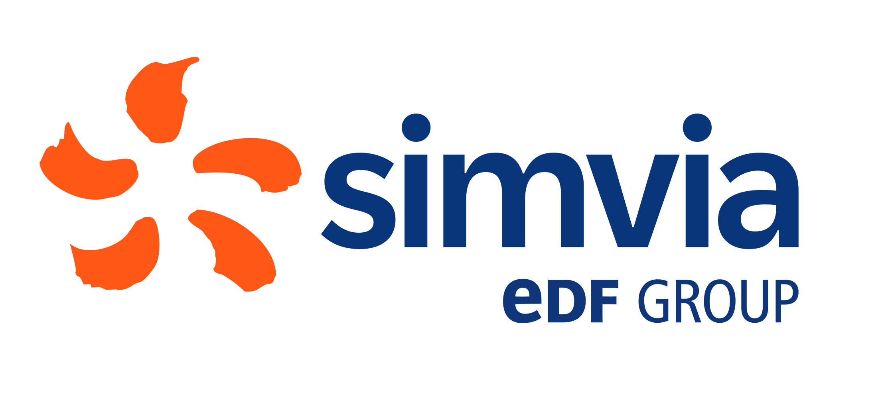
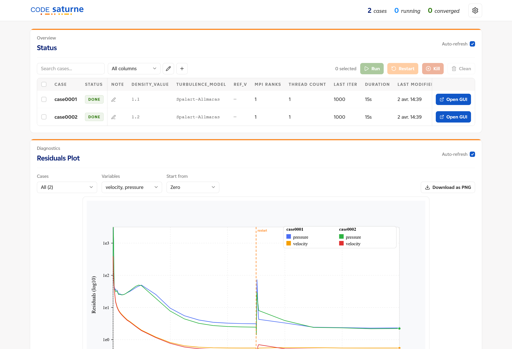

<p align="center"></p>

<p align="center">
  <a href="https://simvia-tech.github.io/csauto/"></a>
  <a href="/"></a>
  <a href="https://github.com/simvia-tech/csauto/actions/workflows/pr.yml"></a>
  <a href="./LICENSE"></a>
</p>

# csauto

This project is in early development. Expect breaking changes until v1.0.

## Description

**csauto** automates [code_saturne](https://www.code-saturne.org/) CFD simulation campaigns.
It offers:

- Generation of tens or hundreds of cases from one template + one CSV, in seconds
- Local and Slurm job execution with status tracking
- A web dashboard for monitoring residuals, probes, logs, and job status in real time
- Restart from checkpoint, live case steering (stop/extend/checkpoint without killing), input file comparison, and cleanup utilities

No manual case duplication. No directory juggling. Just simulations.



## Installation

csauto requires **Python 3.11+** and has **no external dependencies** for core features (pure standard library). The web dashboard requires a few extra packages.

```bash
# One-line install (clones to ~/.local/share/csauto, creates venv, adds alias)
bash -c "$(curl -fsSL https://raw.githubusercontent.com/simvia-tech/csauto/main/install.sh)"

# Reload your shell
source ~/.bashrc   # or: source ~/.zshrc
```

To update an existing installation, re-run the same command — the script detects the existing install, pulls the latest changes, and reinstalls.

<details>
<summary>Manual installation (for contributors or custom locations)</summary>

```bash
git clone https://github.com/simvia-tech/csauto.git ~/tools/csauto
cd ~/tools/csauto

# Option A: use the install script (creates venv, adds alias)
./install.sh

# Option B: manual setup
python3 -m venv .venv && source .venv/bin/activate
pip install -e ".[web]"
```

The `csauto` command is available inside the venv. To use it globally, add an alias:

```bash
echo "alias csauto='$HOME/tools/csauto/.venv/bin/csauto'" >> ~/.bashrc
```

To install without a venv: `./install.sh --no-venv`

</details>

Verify:

```bash
csauto --help
```

### Prerequisites

You need at least one code_saturne runtime:

| Runtime       | Requirement                                      |
|---------------|--------------------------------------------------|
| `native`      | `code_saturne` binary in PATH or set via config  |
| `singularity` | Apptainer/Singularity + a `.sif` image           |
| `docker`      | Docker engine + image                            |

## Usage

> **First time?** Follow the [Quickstart guide](docs/quickstart.md) for a complete walkthrough from zero to a running campaign.

```bash
# 0. (Optional) Generate doe.csv from a parameter spec instead of hand-writing it
csauto doe spec.toml doe.csv --method lhs --samples 40 --seed 42

# 1. Generate cases from your DOE and template
csauto prepare doe.csv TEMPLATE RUNS

# 2. Validate environment
csauto doctor RUNS

# 3. Launch the web dashboard
csauto serve RUNS --host 127.0.0.1 --port 8000
```

Open [http://127.0.0.1:8000](http://127.0.0.1:8000), then launch runs from the **Status** panel: `Ctrl+A` → **Run Selected**.

See [docs/doe-format.md](docs/doe-format.md) for the `doe.csv` format and the `csauto doe` generator (factorial/LHS/Sobol/CCD).

### Example project layout

```
my-campaign/
├── csauto.toml
├── doe.csv
├── TEMPLATE/
│   └── DATA/
│       └── setup.xml      ← uses {u_inlet}, {turbulence_model}, etc.
└── RUNS/                  ← generated by csauto prepare
    ├── registry.json
    ├── case0001/
    └── case0002/
```

### CLI commands

The web UI (`csauto serve`) is the primary interface for runtime monitoring and operations — launching, steering, killing, restarting, comparing, and inspecting cases. The CLI covers initial setup (`prepare`, `doctor`), data export (`residuals`, `perf`), and offers terminal alternatives for common actions.

| Command     | Description                                       | UI equivalent              |
|-------------|---------------------------------------------------|----------------------------|
| `prepare`   | Generate cases from a DOE CSV and a template      | — (CLI only)               |
| `doe`       | Generate a `doe.csv` from a parameter spec (factorial/LHS/Sobol/CCD) | — (CLI only) |
| `doctor`    | Validate runtime environment and configuration    | — (CLI only)               |
| `serve`     | Start the web monitoring dashboard                | — (starts the UI)          |
| `run`       | Launch cases locally or on Slurm (`--n`, `--nt` required) | Status → Run Selected |
| `status`    | Show case status in the terminal                  | Status panel               |
| `tail`      | Stream a case log file (like `tail -f`)           | Log Tail panel             |
| `control`   | Steer a running case: stop/extend/checkpoint/flush | Status → Stop / More ▾ menu |
| `residuals` | Export residuals data and/or SVG plot             | Residuals Plot panel       |
| `perf`      | Extract performance metrics from logs             | Timing Snapshot panel      |
| `cleanup`   | Remove old RESU dirs, logs (`--prune-resu`, etc.) | Status → Clean Selected    |

The web UI also provides features beyond the CLI: kill running cases, edit case files, add notes, mark convergence, compare runs side-by-side, plot probes/profiles, and scan logs for recent errors.

## Troubleshooting

Run `csauto doctor RUNS` to diagnose common issues (missing runtimes, broken paths, configuration errors).

For more details, see the [troubleshooting guide](docs/troubleshooting.md).

## Telemetry

csauto collects anonymous usage statistics to help us understand how the tool is used and prioritize improvements. No personal data, file paths, simulation data, or case names are ever sent.

**What is collected:**

- A random anonymous identifier (persistent across sessions)
- csauto version
- Timezone offset
- Runtime type (docker, singularity, or native)
- Event type (install or serve session)

**When it is sent:**

- Once during first install
- Once when `csauto serve` starts
- A daily heartbeat while the web server is running

**How to opt out:**

```bash
# Via the CLI
csauto disable-telemetry

# During installation
./install.sh --no-telemetry

# Via the web UI
# Open Settings (gear icon) and uncheck "Send anonymous usage statistics"
```

To re-enable: `csauto enable-telemetry`

## Documentation

- [Quickstart](docs/quickstart.md)
- [Core concepts](docs/concepts.md)
- [Web UI guide](docs/web-ui.md)
- [CLI reference](docs/cli.md)
- [Configuration](docs/config.md)
- [DOE format](docs/doe-format.md)
- [Run lifecycle](docs/run-lifecycle.md)
- [HTTP API](docs/api.md)
- [Task cookbook](docs/task-cookbook.md)
- [Limitations](docs/limitations.md)

## Contributing

Please check out our [CONTRIBUTING.md](./CONTRIBUTING.md) file if you want to contribute to the project.

Thank you to all our contributors :

- Ulysse Bouchet - [Email](mailto:ulysse.bouchet@simvia.tech)
- Florian Hermet - [Email](mailto:florian.hermet@simvia.tech)

## Development

```bash
# Install with dev + web dependencies
pip install -e ".[dev,web]"

# Run full test suite
pytest -q

# Run by scope
pytest tests/unit -q
pytest tests/integration -q
pytest tests/web -q

# Run a single test
pytest tests/unit/test_foo.py::test_bar -q
```

### Frontend development

The web dashboard is a SvelteKit app in `frontend/`. The pre-built output (`frontend/dist/`) is committed, so end users don't need Node.js.

To work on the frontend:

```bash
# Install dependencies (requires Node.js and pnpm)
cd frontend && pnpm install

# Start the dev server (hot reload, proxies /api to the backend)
pnpm dev

# In another terminal, start the backend
csauto serve RUNS

# Build for production (updates frontend/dist/)
pnpm build
```

See [architecture](docs/architecture.md) for an overview of the codebase.

## See Also

- [code_saturne](https://www.code-saturne.org/) — the open-source CFD solver csauto automates
- [Simvia's website](https://simvia.tech)

## License

This project is licensed under the GNU General Public License version 3 (GPL-3.0).
See the full license text in the [LICENSE](./LICENSE) file.

- **Summary:** You are free to use, copy, modify, and redistribute this software.
- **Conditions:** Redistributions and derivative works must be licensed under GPL-3.0 and include source or a written offer to provide the source.
- **More information:** https://www.gnu.org/licenses/gpl-3.0.en.html

## Contact Us

Contact us at [ulysse.bouchet@simvia.tech](mailto:ulysse.bouchet@simvia.tech) or [florian.hermet@simvia.tech](mailto:florian.hermet@simvia.tech).
