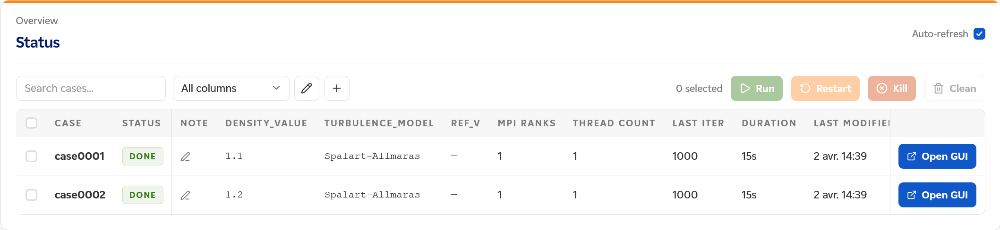
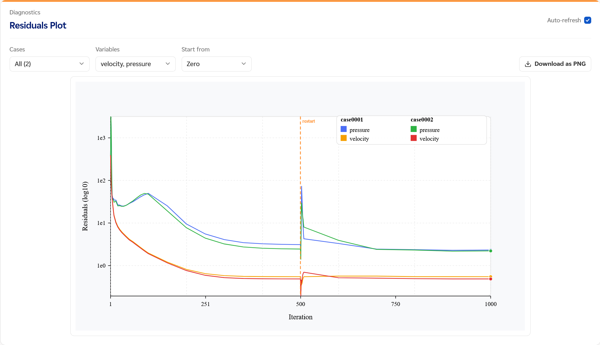
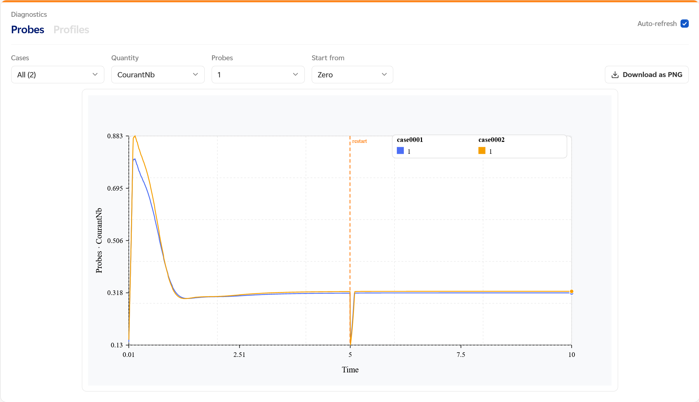
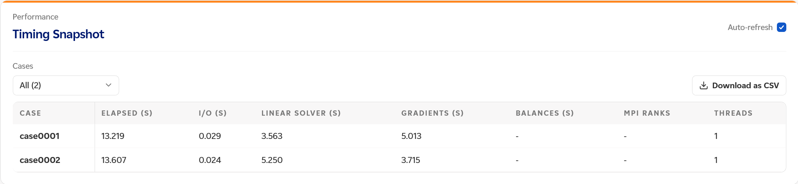
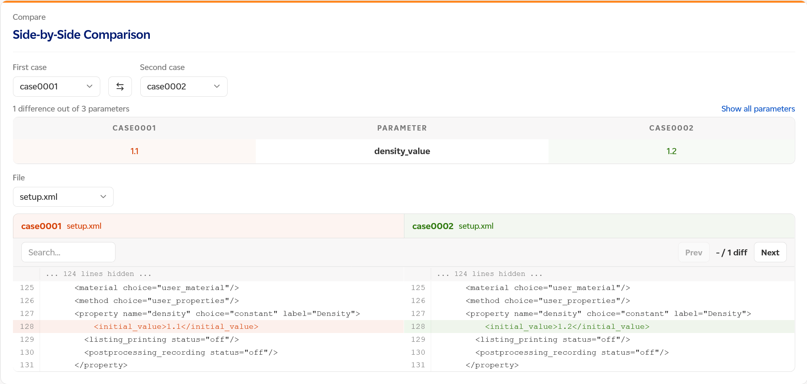
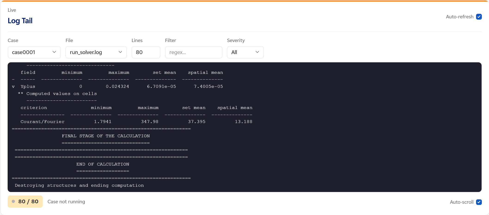
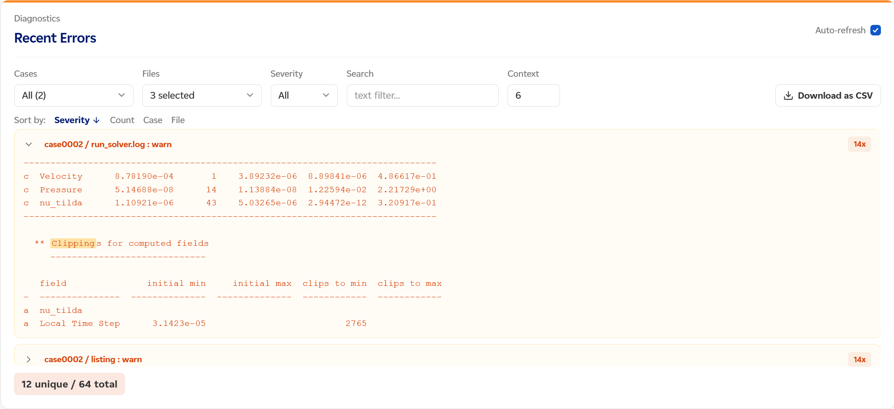

# Web UI Guide

Start the UI:

```bash
csauto serve RUNS --host 127.0.0.1 --port 8000
```

This starts the primary FastAPI server.

Open [http://127.0.0.1:8000](http://127.0.0.1:8000).

On a remote server, use an SSH tunnel first:

```bash
ssh -L 8000:127.0.0.1:8000 your-server
```

---

## Header bar

The header always shows:
- **Cases**: total number of cases in the registry
- **Running**: cases currently in `RUNNING` status
- **Converged**: cases marked as converged

When a filter is active, each metric shows the filtered count out of the total
(e.g., "2 / 5").

Branding is solver-aware: code_saturne campaigns show the Code_Saturne logo in
the header, other solvers show their name as text, and the browser-tab favicon
switches to a solver-specific icon when the frontend ships one.

**Settings** (gear icon, top right): opens a dialog where you can set the
**API token** (if the server requires authentication) and the **auto-refresh
rate**. The token is stored in the browser session.

---

## Status panel



The main table is your campaign dashboard. It refreshes automatically and shows
one row per case.

The toolbar provides:
- A **search bar** to filter cases by name
- An **All columns** dropdown to toggle which columns are visible
- Filter and sort controls per column

| Column | Meaning |
|---|---|
| `CASE` | Case name |
| `STATUS` | `PREPARED`, `RUNNING`, `DONE`, `FAILED` |
| `NOTE` | Free-text note you can set per case |
| DOE columns | Your parameter values, one column per DOE variable |
| `MPI RANKS` | Number of MPI ranks used |
| `THREAD COUNT` | Number of OpenMP threads per rank |
| `LAST ITER` | Last completed iteration |
| `DURATION` | Elapsed time since launch |
| `RESU SIZE (MB)` | Total RESU disk usage |
| `LAST MODIFIED` | Timestamp of the last state change |

Each row also has an **Open GUI** button to launch the code_saturne GUI for that case.

### Selecting cases

- Click a row to select it
- `Ctrl/Cmd + click` to add to selection
- `Shift + click` to select a range
- `Ctrl/Cmd + A` to select all
- `Arrow Up/Down` to navigate rows (`Shift + Arrow` for range selection)
- `Space` to toggle selection (`Shift + Space` for range)
- `Esc` to deselect

### Bulk actions

With one or more cases selected, the action buttons activate:

**Run**: launch the selected cases (`PREPARED`, `DONE`, or `FAILED`). A popup
asks for `--n` (MPI ranks), `--nt` (OMP threads), and `--max-parallel`.

**Restart**: restart from the latest checkpoint. A popup asks for the
stop criterion:
- `Iterations`: add N more iterations beyond the current checkpoint
- `Physical time`: run until a physical time target

csauto automatically finds the latest checkpoint and computes the absolute
target value. You do not need to know the checkpoint path.

**Stop**: gracefully stop the selected running cases — code_saturne finishes
its current time step, writes a checkpoint, and exits on its own. Unlike
Kill, no process is signaled and no restart is needed afterwards.

**More ▾**: secondary controls for running cases, next to Stop:
- **Extend**: raise the time step limit so the case keeps going instead of
  stopping. A popup asks how many additional time steps to add to the case's
  configured limit (repeated extends stack correctly).
- **Checkpoint**: request a checkpoint at the next time step, without
  stopping the run. Useful for grabbing a restart point mid-run. This does
  not add a marker to the Residuals/Probes plots — those only mark actual
  restarts (a new run launched from a checkpoint), not in-place checkpoints.
- **Flush**: force logs and time-plot/probe files to be written to disk
  immediately, without waiting for the next automatic write. Doesn't affect
  the simulation itself.

**Kill**: send a termination signal to the selected running cases.
Works for both local processes and Slurm jobs. Use Stop instead when you
just want the run to wind down cleanly — Kill discards in-flight work and
requires restarting from the last checkpoint.

**Clean**: remove old RESU directories and/or truncate heavy logs for
the selected cases. A popup lets you choose which RESU runs to keep or delete.

### Context menu on finished cases

Right-click a `DONE` or `FAILED` row to:
- **Mark Converged**: set convergence label to `converged`
- **Mark Not Converged**: set to `not converged`
- **Clear**: remove the convergence label

---

## Residuals Plot



Use this panel to inspect solver convergence for one or more cases.

1. Select one or more cases from the **Cases** dropdown
2. Choose the **Variables** to plot (e.g., velocity, pressure)
3. Choose the **Start from** point:
   - `Zero`: plot from the very beginning, including previous runs in RESU history
   - `Restart start`: start from the last restart checkpoint iteration
   - `Custom`: manually set the minimum iteration to display
4. The chart updates automatically when auto-refresh is enabled

The SVG chart shows residuals vs. iteration number. Multiple cases are overlaid
on the same chart for comparison. A vertical dashed line marks restart points.

Click **Download as PNG** to export the chart.

---

## Probes and Profiles



This panel has two tabs — **Probes** and **Profiles** — each shown only when
the relevant output files exist in the case's RESU directory.

### Probes tab

Shown when `RESU/<run>/monitoring/*.csv` files exist.

1. Select one or more cases from the **Cases** dropdown
2. Choose the **Quantity** (probe file to read, e.g., CourantNb)
3. Select one or more **Probes** (data columns within that file)
4. Choose the **Start from** point (`Zero`, `Restart start`, or `Custom`)
5. The chart plots the selected probes over time

The spatial coordinates of each selected probe are displayed below the controls.

### Profiles tab

Shown when `RESU/<run>/profiles/*.csv` files exist.

1. Select one or more cases from the **Cases** dropdown
2. Choose the **Profile** file
3. Choose the **X axis** column (e.g., abscissa, distance)
4. Select one or more **Values** to plot against the X axis
5. Choose the **Start from** point (`Zero`, `Restart start`, or `Custom`)

Click **Download as PNG** to export either chart.

---

## Timing Snapshot



Displays performance metrics for one or more cases in a comparison table.

Select cases from the **Cases** dropdown. The column set is declared by the
solver adapter; with code_saturne the table shows:

| Column | Meaning |
|---|---|
| `CASE` | Case name |
| `ELAPSED (S)` | Total elapsed wall-clock time |
| `I/O (S)` | Time spent on file I/O |
| `LINEAR SOLVER (S)` | Time spent in the linear solver |
| `GRADIENTS (S)` | Time spent computing gradients |
| `BALANCES (S)` | Time spent on balance computations |
| `MPI RANKS` | Number of MPI ranks used |
| `THREADS` | Number of OpenMP threads per rank |

Click **Download as CSV** to export the table.

---

## Side-by-Side Comparison



Compare two cases side by side: parameters and file contents.

Steps:
1. Select the **First case** and **Second case** from the dropdowns (use the
   swap button to switch them)
2. The panel shows a **parameter diff** summary (e.g., "1 difference out of 3
   parameters"). Click **Show all parameters** to see matching parameters too
3. Choose a **File** to compare — the list is declared by the solver adapter,
   and its first entry is the default (with code_saturne: `setup.xml`,
   `doe_row.csv`, `run_solver.log`, or `performance.log`)
4. Use the **Search** bar to filter lines

The output shows a side-by-side diff with line numbers. Differing lines are
highlighted for quick identification.

---

## Log Tail



Stream the end of a case log file, similar to `tail -f`.

**Which file to read:**

| Situation | File to use |
|---|---|
| Solver running, check progress | `listing` |
| Solver error or crash | `run_solver.log` |
| Launch issue (process didn't start) | `csauto.stdout` / `csauto.stderr` |
| Slurm submission issue | `csauto.stdout` |

Controls:
- **Case**: select the case
- **File**: choose the log file
- **Lines**: number of lines to display (default 80)
- **Filter**: regex filter to match specific lines
- **Severity**: filter by `error`, `warn`, or `All`

The bottom bar shows:
- A **line count** indicator (filtered lines / total, e.g., "80 / 80")
- A **status indicator**: pulsing red dot when the case is running, grey dot
  when stopped
- A **Pause / Resume** button (available when the case is running)
- An **Auto-scroll** toggle to keep the view at the bottom as new lines arrive

---

## Recent Errors



Scan log files for errors, warnings, and informational messages.

When to use: a case finished with `FAILED`, or you see unexpected behavior and
want a quick summary of what went wrong without reading the full log.

Controls:
- **Cases**: select which cases to scan
- **Files**: select which log files to include (multi-select; the list is
  declared by the solver adapter — with code_saturne: `csauto.stderr`,
  `run_solver.log`, `listing`, `csauto.stdout`)
- **Severity**: `All`, `Error`, `Warn`, `Info`
- **Search**: plain-text search within matched lines
- **Context**: how many lines before and after each hit to display (default 6)

Results are deduplicated by fingerprint and grouped by case and file, with
expandable sections. Each section shows matched lines highlighted in context.
Errors not seen in the previous scan are tagged with a **NEW** badge. The
summary bar shows the count of unique and total matches (e.g., "12 unique / 64
total").

Use **Sort by** to reorder results by Severity, Count, Case, or File.

Click **Download as CSV** to export the results.

---

## Serving on a public host

If you need to expose the UI beyond localhost (e.g., to colleagues), configure
an API token first:

```toml
# csauto.toml
[api]
token = "your-secret-token"
```

Then serve with:

```bash
csauto serve RUNS --host 0.0.0.0 --port 8000
```

Without a token, csauto refuses to bind to a public address.

Users accessing the UI must click the **Settings** gear icon and enter the token
once per browser session.
