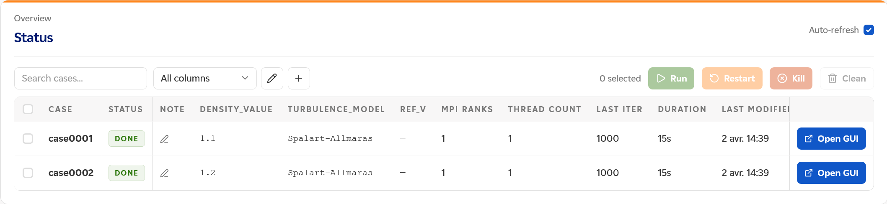
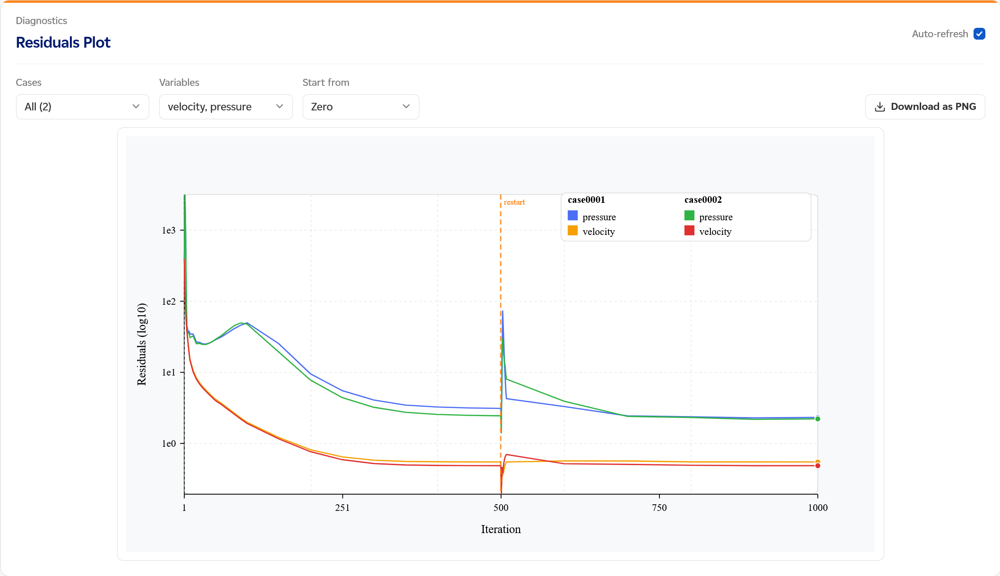
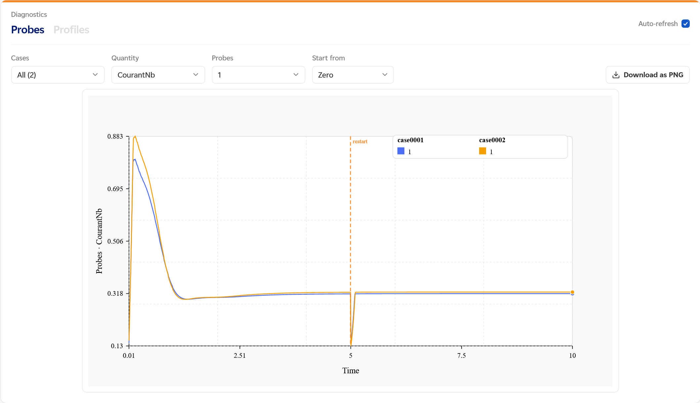
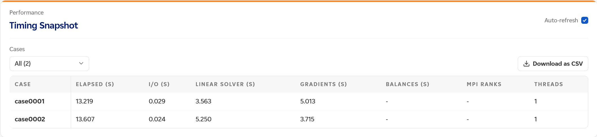
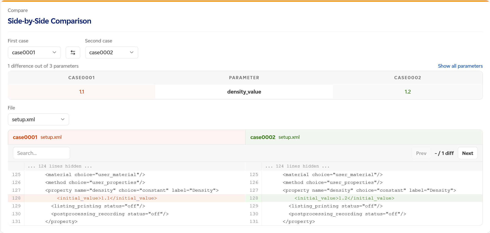
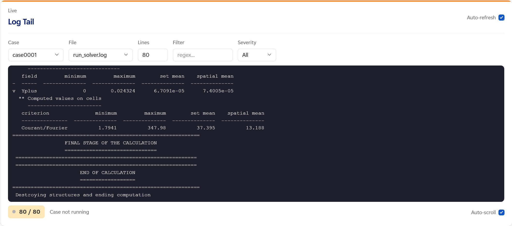
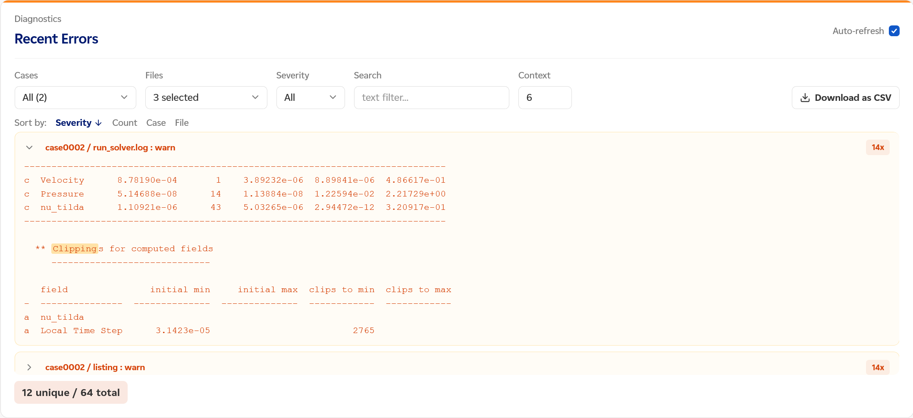

# Web UI Guide

Start the UI:

```bash
csauto serve RUNS --host 127.0.0.1 --port 8000
```

This starts the primary FastAPI server.

Open [http://127.0.0.1:8000](http://127.0.0.1:8000).

On a remote server, use an SSH tunnel first:

```bash
ssh -L 8000:127.0.0.1:8000 your-server
```

---

## Header bar

The header always shows:
- **Cases**: total number of cases in the registry
- **Running**: cases currently in `RUNNING` status
- **Converged**: cases marked as converged

When a filter is active, each metric shows the filtered count out of the total
(e.g., "2 / 5").

The header shows the solver's logo and the browser tab its icon, both provided
by the solver adapter; a solver without a logo shows its name as text. Until
the dashboard has loaded the solver's description from the server, it shows
only the Status, Log Tail and Recent Errors panels and no solver action.

The panels and buttons depend on the solver: each one appears only when the
solver provides what it needs (see
[Adding a new solver](./adding-a-solver.md#4-fill-the-dashboard)). The examples
below use code_saturne, which uses all of them.

**Settings** (gear icon, top right): opens a dialog where you can set the
**API token** (if the server requires authentication) and the **auto-refresh
rate**. The token is stored in the browser session.

---

## Status panel



The main table is your campaign dashboard. It refreshes automatically and shows
one row per case.

The toolbar provides:
- A **search bar** to filter cases by name
- An **All columns** dropdown to toggle which columns are visible
- Filter and sort controls per column

| Column | Meaning |
|---|---|
| `CASE` | Case name |
| `STATUS` | `PREPARED`, `RUNNING`, `DONE`, `FAILED` |
| `NOTE` | Free-text note you can set per case |
| DOE columns | Your parameter values, one column per DOE variable |
| `MPI RANKS` | Number of MPI ranks used |
| `THREAD COUNT` | Number of OpenMP threads per rank |
| `LAST ITER` | Last completed iteration |
| `DURATION` | Elapsed time since launch |
| `RESULTS (MB)` | Disk usage of the case's results folder |
| `LAST MODIFIED` | Timestamp of the last state change |

When the solver has a GUI (code_saturne does), each row also has an **Open GUI** button that opens it on the case's setup file.

### Selecting cases

- Click a row to select it
- `Ctrl/Cmd + click` to add to selection
- `Shift + click` to select a range
- `Ctrl/Cmd + A` to select all
- `Arrow Up/Down` to navigate rows (`Shift + Arrow` for range selection)
- `Space` to toggle selection (`Shift + Space` for range)
- `Esc` to deselect

### Bulk actions

With one or more cases selected, the action buttons activate:

**Run**: launch the selected cases (`PREPARED`, `DONE`, or `FAILED`). A popup
asks for **MPI Ranks (n)**, **OMP Threads (nt)** and **Max Parallel** (left
empty, every selected case starts at once).

**Restart** (when the solver supports it): continue finished cases. A popup
offers the solver's restart modes and asks for a value when the mode takes
one. With code_saturne:
- `Additional iterations`: add N more iterations beyond the checkpoint
- `Additional physical time`: run for that much more physical time

**Restart from** picks the run to restart from (one case selected); by default
csauto uses the latest run that has a checkpoint and computes the absolute
target value for you.

**Control** (when the solver supports live control): a menu of the actions the
solver offers for running cases. Actions that take a value ask for it; the
others ask for confirmation. With code_saturne:
- **Stop gracefully**: finish the current time step, write a checkpoint and
  exit. Unlike Kill, no process is signaled and no restart is needed.
- **Extend**: raise the time step limit so the case keeps going. Asks for the
  number of additional time steps (repeated extends stack correctly).
- **Write a checkpoint**: at the next time step, without stopping the run.
  Plots mark restarts (new runs launched from a checkpoint), not in-place
  checkpoints.
- **Flush logs and plots**: write logs and probe files to disk now. It does
  not affect the simulation.

**Kill**: stop the selected running cases at once. Works for local processes,
containers and Slurm jobs. Prefer a graceful stop when the solver offers one:
Kill discards in-flight work.

**Clean**: delete old run folders and/or shorten heavy logs for the selected
finished cases. A popup lets you keep the latest N runs, delete them all, or,
with a single case selected, pick the run folders to keep or delete (run
folders are named per case). Clean only deletes the folders the solver reports
as runs (code_saturne: each `RESU/<run>`; code_aster: `RESU` itself, its single
run) and never touches running or queued cases; a notice lists the ones it
skipped. A case whose runs were all deleted returns to `PREPARED`. Clean
also shortens logs larger than 50 MB to their last 50 MB and removes the
docker container id file (`.csauto.cid`).

### Context menu on finished cases

Right-click a `DONE` or `FAILED` row to:
- **Mark Converged**: set convergence label to `converged`
- **Mark Not Converged**: set to `not converged`
- **Clear Mark**: remove the convergence label

---

## Residuals Plot



Use this panel to inspect solver convergence for one or more cases.

1. Select one or more cases from the **Cases** dropdown
2. Choose the **Variables** to plot (e.g., velocity, pressure)
3. Choose the **Start from** point:
   - `Zero`: plot from the very beginning, including the case's previous runs
   - `Restart start`: start from the last restart checkpoint iteration
   - `Custom`: manually set the minimum iteration to display
4. The chart updates automatically when auto-refresh is enabled

The SVG chart shows residuals vs. iteration number. Multiple cases are overlaid
on the same chart for comparison. A vertical dashed line marks restart points.

Click **Download as PNG** to export the chart.

---

## Probes and Profiles



This panel has two tabs, **Probes** and **Profiles**, each shown when the case
has such files (with code_saturne, in its latest `RESU/<run>`).

### Probes tab

With code_saturne: `RESU/<run>/monitoring/*.csv`.

1. Select one or more cases from the **Cases** dropdown
2. Choose the **Quantity** (probe file to read, e.g., CourantNb)
3. Select one or more **Probes** (data columns within that file)
4. Choose the **Start from** point (`Zero`, `Restart start`, or `Custom`)
5. The chart plots the selected probes over time

The spatial coordinates of each selected probe are displayed below the controls.

### Profiles tab

With code_saturne: `RESU/<run>/profiles/*.csv`.

1. Select one or more cases from the **Cases** dropdown
2. Choose the **Profile** file
3. Choose the **X axis** column (e.g., abscissa, distance)
4. Select one or more **Values** to plot against the X axis
5. Choose the **Start from** point (`Zero`, `Restart start`, or `Custom`)

Click **Download as PNG** to export either chart.

---

## Timing Snapshot



Displays performance metrics for one or more cases in a comparison table.

Select cases from the **Cases** dropdown. The column set is declared by the
solver adapter; with code_saturne the table shows:

| Column | Meaning |
|---|---|
| `CASE` | Case name |
| `ELAPSED (S)` | Total elapsed wall-clock time |
| `I/O (S)` | Time spent on file I/O |
| `LINEAR SOLVER (S)` | Time spent in the linear solver |
| `GRADIENTS (S)` | Time spent computing gradients |
| `BALANCES (S)` | Time spent on balance computations |
| `MPI RANKS` | Number of MPI ranks used |
| `THREADS` | Number of OpenMP threads per rank |

Click **Download as CSV** to export the table.

---

## Side-by-Side Comparison



Compare two cases side by side: parameters and file contents.

Steps:
1. Select the **First case** and **Second case** from the dropdowns (use the
   swap button to switch them)
2. The panel shows a **parameter diff** summary (e.g., "1 difference out of 3
   parameters"). Click **Show all parameters** to see matching parameters too
3. Choose a **File** to compare: the list comes from the solver, and its first
   entry is the default (code_saturne: `setup.xml`, `doe_row.csv`,
   `run_solver.log`, `performance.log`; code_aster: the export file and
   `doe_row.csv`)
4. Use the **Search** bar to filter lines

The output shows a side-by-side diff with line numbers. Differing lines are
highlighted for quick identification.

---

## Log Tail



Stream the end of a case log file, similar to `tail -f`.

The **File** list puts the solver's main logs first, then `csauto.stdout` and
`csauto.stderr` (the console output of the launch, available for every solver)
and the other `*.log` files of the latest run. The first file is selected by
default.

| Situation | File to use |
|---|---|
| Solver running, check progress | the solver's main log (code_saturne: `run_solver.log`; code_aster: `csauto.stdout`) |
| Launch issue (the solver did not start) | `csauto.stderr` / `csauto.stdout` |
| Slurm submission issue | `csauto.stdout` |

Controls:
- **Case**: select the case
- **File**: choose the log file
- **Lines**: number of lines to display (default 80)
- **Filter**: regex filter to match specific lines
- **Severity**: filter by `Error`, `Warn` or `All`. Lines are coloured
  with the same patterns Recent Errors uses for this solver

The bottom bar shows:
- A **line count** indicator (filtered lines / total, e.g., "80 / 80")
- A **status indicator**: pulsing red dot when the case is running, grey dot
  when stopped
- A **Pause / Resume** button (available when the case is running)
- An **Auto-scroll** toggle to keep the view at the bottom as new lines arrive

---

## Recent Errors



Scan log files for errors, warnings, and informational messages.

When to use: a case finished with `FAILED`, or you see unexpected behavior and
want a quick summary of what went wrong without reading the full log.

Controls:
- **Cases**: select which cases to scan
- **Files**: select which log files to include (multi-select; the list comes
  from the solver; with code_saturne: `csauto.stderr`, `run_solver.log`,
  `listing`, `csauto.stdout`)
- **Severity**: `All`, `Error`, `Warn`
- **Search**: plain-text search within matched lines
- **Context**: how many lines before and after each hit to display (default 6)

Results are deduplicated by fingerprint and grouped by case and file, with
expandable sections. Each section shows matched lines highlighted in context.
Errors not seen in the previous scan are tagged with a **NEW** badge. The
summary bar shows the count of unique and total matches (e.g., "12 unique / 64
total").

Use **Sort by** to reorder results by Severity, Count, Case, or File.

Click **Download as CSV** to export the results.

---

## Serving on a public host

If you need to expose the UI beyond localhost (e.g., to colleagues), configure
an API token first:

```toml
# csauto.toml
[api]
token = "your-secret-token"
```

Then serve with:

```bash
csauto serve RUNS --host 0.0.0.0 --port 8000
```

Without a token, csauto refuses to bind to a public address.

Users accessing the UI must click the **Settings** gear icon and enter the token
once per browser session.
